# 💰 MiniBank – iOS Banking App (Swift / UIKit)

A fully functional mock banking application built with UIKit and Swift.  
It demonstrates clean iOS architecture and uses multiple techniques for data flow, screen navigation, and user experience enhancements.

---

## 📱 Screens Overview

### 🔐 Login Screen
- Enter **Username**, **Account Number**, and **Password**
- Input validation and error alerts
- Successful login navigates to Dashboard
- Username is persisted via `UserDefaults`

---

### 🏠 Dashboard Screen
- Displays welcome message using stored username
- Buttons to:
  - Send Money
  - View Transaction Details
  - View Profile

---

### 💸 Send Money
- Enter:
  - Receiver's name
  - Amount
  - Reason for transfer
  - Date via custom **Date Picker**
- Validations for all fields
- Tap to dismiss custom PopUp after success
- Save transaction data to `UserDefaults`
- Data passed back using `Delegate` protocol

---

### 🗓 Date Picker (PopUp)
- Custom modal popup to select a transfer date
- Dismiss by tapping outside or pressing Save
- Uses `Closure` to pass selected date back

---

### 📄 Transaction Details
- Displays:
  - Receiver's name
  - Amount
  - Reason
  - Date
- Data loaded from `UserDefaults`

---

### 👤 Profile Screen
- Shows:
  - Name
  - Email
  - Account Number
- Data loaded from `UserDefaults`
- Navigates to Edit Profile screen

---

### ✏️ Edit Profile
- Edit Name, Email, Account Number
- Validates inputs
- Uses `Delegate & Protocol` to pass data back
- Also saves data to `UserDefaults`

---

## 🧠 Key Features & Concepts Reviewed

| Feature | ✅ Implemented |
|--------|----------------|
| StackView layout & AutoLayout | ✅  
| Custom class for elements | ✅  
| IBOutlet & IBAction usage | ✅  
| Push & Pop navigation | ✅  
| Present & Dismiss navigation | ✅  
| Pass data between ViewControllers (Instance & Downcast) | ✅  
| `if let` Optional Unwrapping | ✅  
| Data back via Closure | ✅  
| Data back via Delegate & Protocol | ✅  
| Data back via NotificationCenter | ⚠️ *Planned*  
| Validation and Alerts | ✅  
| Tap to dismiss popup | ✅  
| Custom Date Picker | ✅  
| Local persistence via `UserDefaults` | ✅

---

## 🛠 Tech Stack

- Swift 5
- UIKit
- Xcode Storyboard
- UserDefaults
- MVC Architecture
- Delegate & Protocol
- Closure
- Custom UIAlerts

---
## 🖼 App Screenshots

<p align="center">
  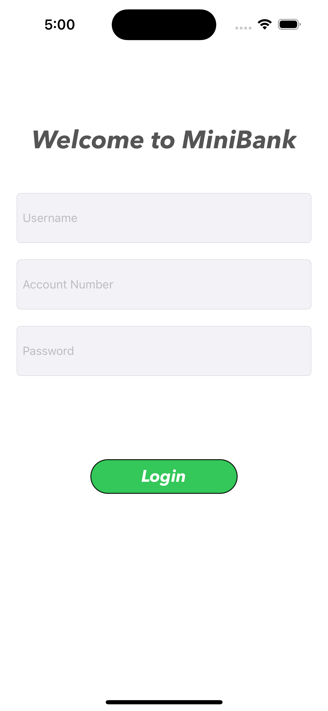
  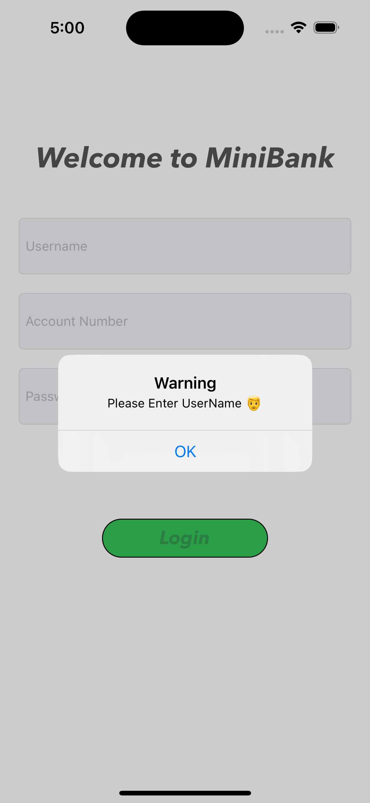
  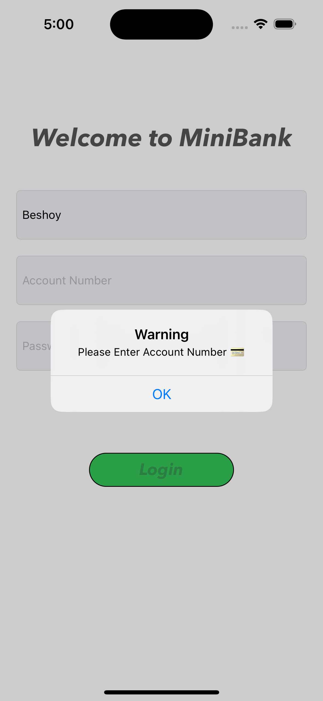
  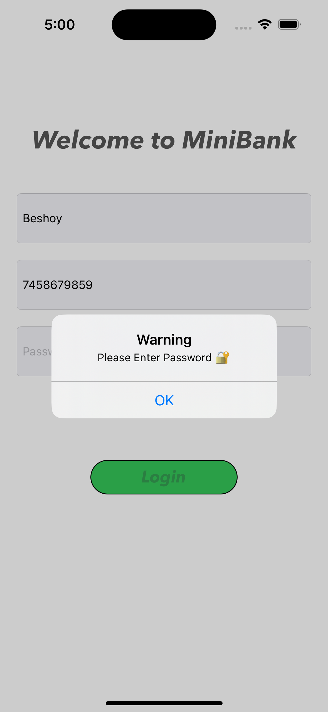
  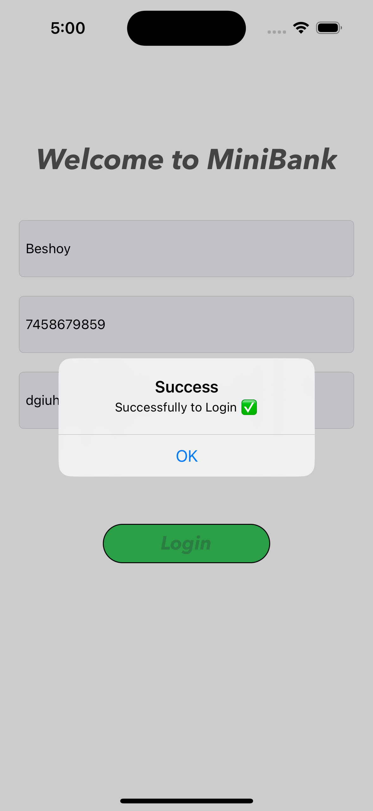
  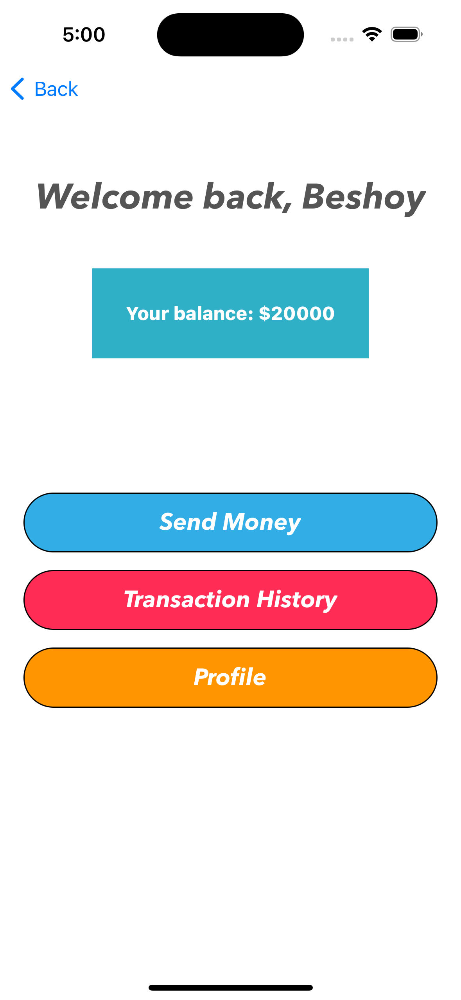
  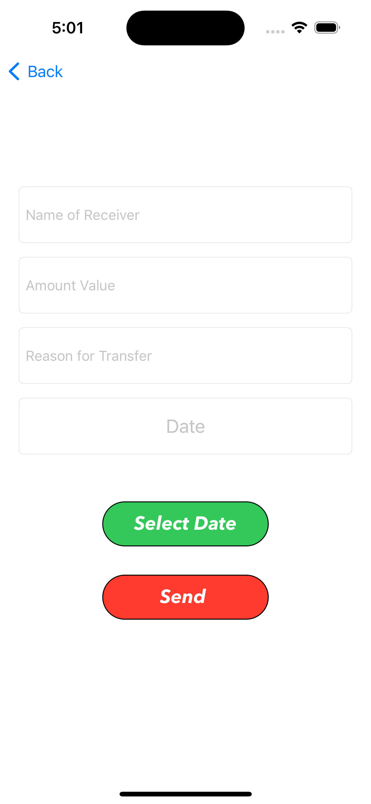
  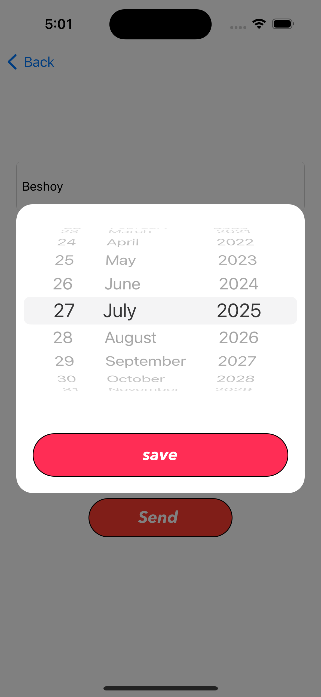
  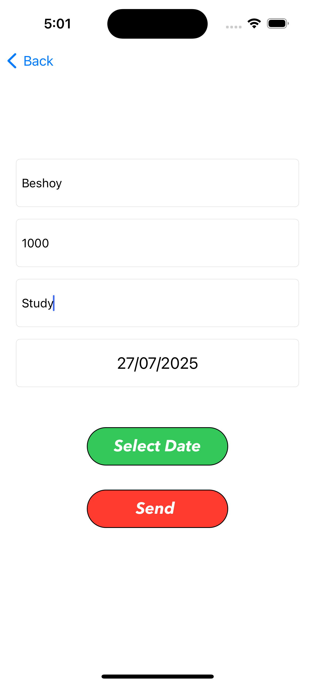
  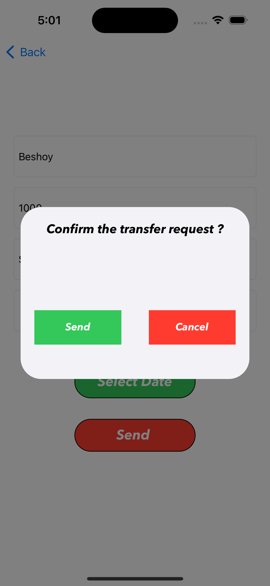
  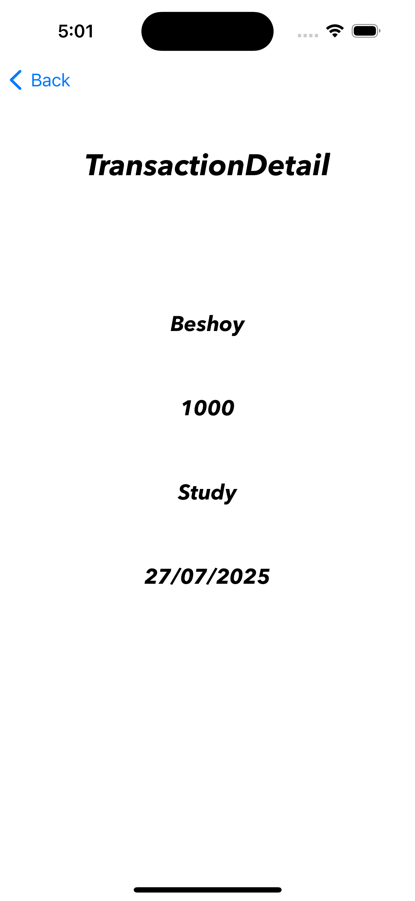
  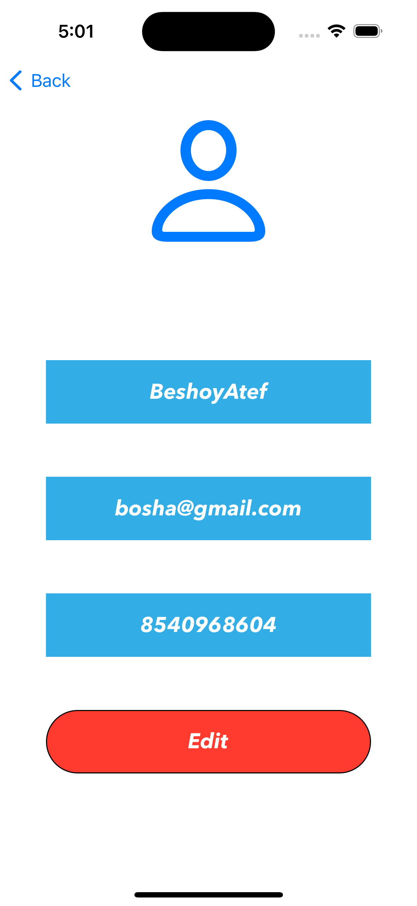
  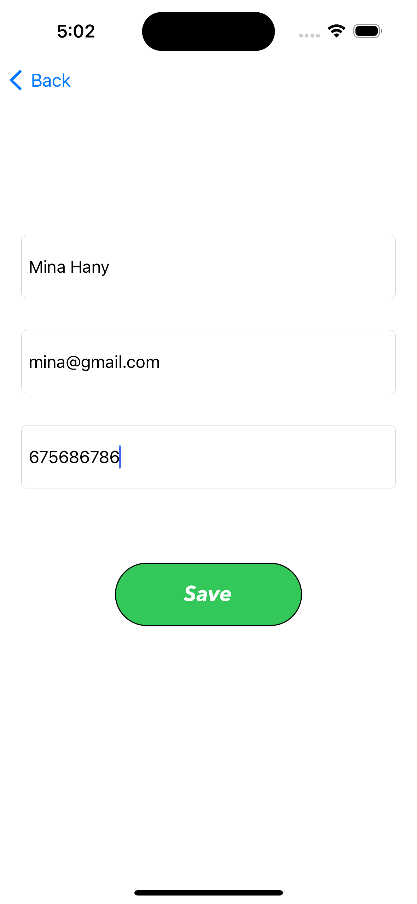
  
  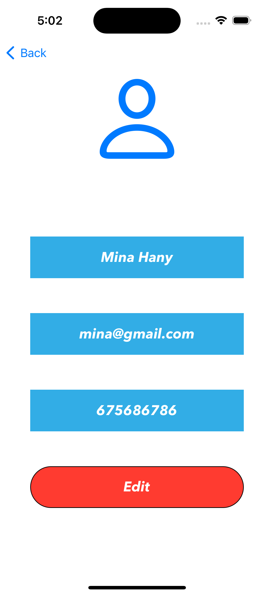
</p>

---

## 🚀 How to Run

1. Clone the repo:
   ```bash
   git clone https://github.com/your-username/MiniBank.git

---

## 👨‍💻 Developed By

**Beshoy Atef**  
📆 July 2025

---

> This project is ideal for beginners learning iOS local persistence and input validation using UIKit.
